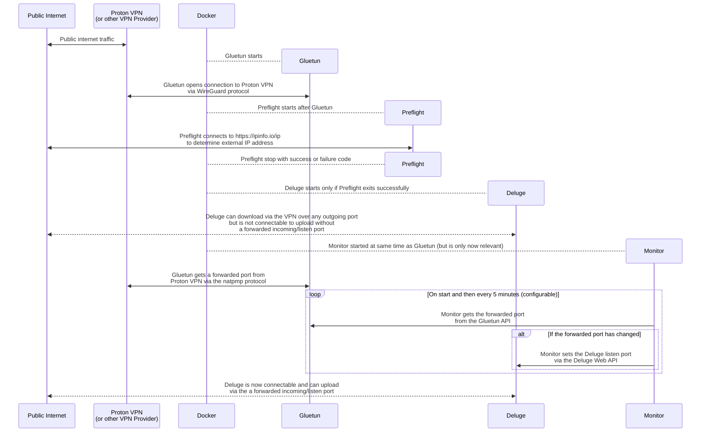

# Deluge via Proton VPN with port forwarding

This is part 1 of the series: [Deluge via Proton VPN with port forwarding](https://github.com/RogueOneEcho/how-to-setup-deluge-with-protonvpn-portforward).

This part shows how to make Deluge connectable via Proton VPN with port forwarding.

All services are run in Docker containers and managed with Docker Compose.

*Due to the flexibility of [Gluetun](https://github.com/qdm12/gluetun) the guide can be easily adapted to work with any wireguard or OpenVPN based VPN provider by referring to the [Gluetun wiki documentation](https://github.com/qdm12/gluetun-wiki).*

*Prior knowledge of Docker, Deluge and linuxserver.io containers are assumed.*

## Technologies
- [Docker Compose](https://docs.docker.com/compose/install/)
- [Deluge - linuxserver.io container](https://fleet.linuxserver.io/image?name=linuxserver/deluge)
- [Gluetun](https://github.com/qdm12/gluetun)
- [Proton VPN](https://protonvpn.com/)
- [WireGuard](https://www.wireguard.com/)

## How it works



### Gluetun

The `tunnel` service runs [Gluetun](https://github.com/qdm12/gluetun) which:
- tunnels network traffic via the VPN
- obtains a forwarded port from the VPN provider via the natpmp protocol

The other services use `tunnel` as their network due to `network_mode: "service:tunnel"`.

### Preflight

The `preflight` service runs a [bash script](preflight/preflight) to check:
- the mountpoint is working
- the external ip https://ipinfo.io/ip is reported as the VPN.

Only after `preflight` exits successfully do the `deluge` and `prowlarr` services start due to:

```yaml
depends_on:
  preflight:
    condition: service_completed_successfully
```

### Monitor

The `monitor` service runs a [bash script](monitor/monitor) that obtains the forwarded port from the gluetun API and sets the listening port of `deluge`.

If the monitor script fails it retries waits for a duration defined as `RETRY`, until it's successful. Then it waits a duration defined by `INTERVAL` before running again, therefore if the forwarded port happens to change it will be updated in `deluge`.

### Deluge

The `deluge` service runs the [Deluge](https://deluge-torrent.org/) web client and daemon as a [linux-server.io container](https://fleet.linuxserver.io/image?name=linuxserver/deluge).

## Getting started

### 1. Create a WireGuard configuration

From the ProtonVPN website, [create a WireGuard configuration](
https://account.proton.me/u/3/vpn/WireGuard).

Use a memorable `device/certificate name` so you can easily revoke or extend it later.

Set the platform to `GNU/Linux`.

Set `Level for NetShield blocker filtering` to `No filter` - probably not required.

Set `Moderate NAT` to `Yes` - probably not required.

Set `NAT-PMP (Port Forwarding)` to `Yes` - **important**.

Set `VPN Accelerator` to `Yes` - probably not required.

Select a server location from `Standard server configs` that has the `⇆` icon for `P2P`. Avoid any TOR servers.

Save the file as you won't be able to read the private key again.

The file should look something like this:

```ini
[Interface]
# Key for deluge
# Bouncing = 14
# NetShield = 0
# Moderate NAT = on
# NAT-PMP (Port Forwarding) = on
# VPN Accelerator = on
PrivateKey = CIGiABCDEFGkNDgXCiyidFc61ybHJ1S5ufvUd2NNG3k=
Address = 10.2.0.2/32
DNS = 10.2.0.1

[Peer]
# CH#999
PublicKey = n+45suABCDEFGuZWtCnzGkXNBCgJB3wFZYIlBltpORM=
AllowedIPs = 0.0.0.0/0
Endpoint = 203.0.113.1:51820
```


### 2. Update the `tunnel` environment variables

In `docker-compose.yml` find the `tunnel` service and update the `environment` variables by copying the values from the WireGuard configuration file:

- `PrivateKey` to `WIREGUARD_PRIVATE_KEY`
- `Address` to `WIREGUARD_ADDRESSES`
- `PublicKey` to `WIREGUARD_PUBLIC_KEY`
- The IP address from `Endpoint` to `WIREGUARD_ENDPOINT` - `203.0.113.1` in this example.
- The port from `Endpoint` to `WIREGUARD_PORT` - `51820` in this example.

*For other VPN providers, you can follow their documentation to create a WireGuard configuration, or refer to the [Gluetun documentation](https://github.com/qdm12/gluetun-wiki).*

If you're using a VPN provider who use pre-shared keys then also:

- `PreSharedKey` to `WIREGUARD_PRESHARED_KEY`

### 3. Update the `preflight` environment variables

In `docker-compose.yml` find the `preflight` service and update the `environment` variables by copying the values from the WireGuard configuration file:

- Copy IP address from `Endpoint` to `EXPECTED_IP` - `203.0.113.1` in this example.

NOTE: Sometimes the VPN will actually use a different IP address to the endpoint, so you may need to adjust this value. Check the logs of `monitor` when you reach step 8 to see the IP address that is actually being used and copy it.

### 4. Update the `monitor` environment variables

The `monitor` service loads environment variables from both the `environment` section of `docker-compose.yml` and a `monitor/.env` file. This is better practice for storing sensitive data such as passwords, you can even go a step further and use [secrets](https://docs.docker.com/compose/how-tos/use-secrets/) but that's out of scope here.

Copy the `monitor/.env.example` file to `monitor/.env` and set the `DELUGE_PASSWORD` variable to your deluge web client password. If you've not set a password already then the default is `deluge`.

```bash
cp monitor/.env.example monitor/.env
```

You can also adjust the frequency and verbosity of the monitor: in `docker-compose.yml` find the `monitor` service and update the `environment` variables as follows:

While getting started and testing the following values work well:

```yml
LOG_LEVEL: info
INTERVAL: 30s
RETRY: 2s
```

But those are verbose and frequent, so for production use:

```yml
LOG_LEVEL: warn
INTERVAL: 5m
RETRY: 2s
```

`INTERVAL` is the time between successful runs of the monitor script, and `RETRY` is the time to wait before retrying when an error is encountered.

### 5. Set the volume paths in `docker-compose.yml`

Check the `volumes` section of each service in `docker-compose.yml` and update the paths to match your host system.

The default is to use `/media` for anything downloaded in `deluge` and `/data` for configuration and data volumes of each service. You can change these to suit your needs.

NOTE: By default deluge will download to `/downloads`, so this will need to be modified to `/media/deluge` (or similar) in the deluge web client settings.

If you're using a value other than `/media` then also update the `MOUNTPOINT` environment variable of `preflight`.

### 6. Start the services

Start up the docker compose services:

```bash
docker compose up -d
```

Check the status of the services:

```bash
docker ps --format "table {{.Names}}\t{{.Image}}\t{{.Status}}"
```

Continuously watch the statuses (updated every 2 seconds):

```bash
watch --interval 2 docker ps --format "table {{.Names}}\t{{.Image}}\t{{.Status}}"
```

Follow the `tunnel` logs to ensure Gluetun successfully connects to Proton VPN.

```bash
docker compose logs -f tunnel
```

Follow the `preflight` logs to ensure the external IP address is correct and the mountpoint is valid:

```bash
docker compose logs -f preflight
```

Follow the `monitor` logs to ensure Monitor was able to get the forwarded port from Gluetun and set the Deluge listen port:

```bash
docker compose logs -f monitor
```

Follow all logs to ensure everything is running smoothly, although this will be incredibly verbose:

```bash
docker compose logs -f
```

To stop all the services:

```bash
docker compose down
```

### 7. Access the Deluge Web UI

Once the services are running you can access the Deluge web client at http://localhost:8112.

In the Deluge web client you'll want to change a few settings:
- `Preferences` -> `Downloads` set `Download to` to `/media/deluge` or however you configured it in step 5.
- `Preferences` -> `Network` under `Incoming Port` uncheck `Random`.
- `Preferences` -> `Interface` update the `WebUI Password` then return to step 4 and update the `monitor/.env` with the new password.

If you want to use the Deluge desktop client:
- `Preferences` -> `Daemon` check `Allow Remote Connections`.

Once everything is running smoothly go back to step 4 and update the `monitor` settings for production use and restart the services with the updated configuration:

```bash
docker compose up -d
```

## Troubleshooting

1. Check the logs
2. Re-read the guide
3. [Ask for help in GitHub Discussions](https://github.com/RogueOneEcho/how-to-setup-deluge-with-protonvpn-portforward/discussions)
4. [Create an issue](https://github.com/RogueOneEcho/how-to-setup-deluge-with-protonvpn-portforward/issues)

## Acknowledgements

This guide is based on the great work of [xitation](https://github.com/xitation/protonvpn-deluge-gluetun-portforward).

The following may be useful for other clients:
- [Transmission](https://github.com/haugene/docker-transmission-openvpn) by haugene
- [qBittorrent](https://github.com/mjmeli/qbittorrent-port-forward-gluetun-server) by mjmeli
